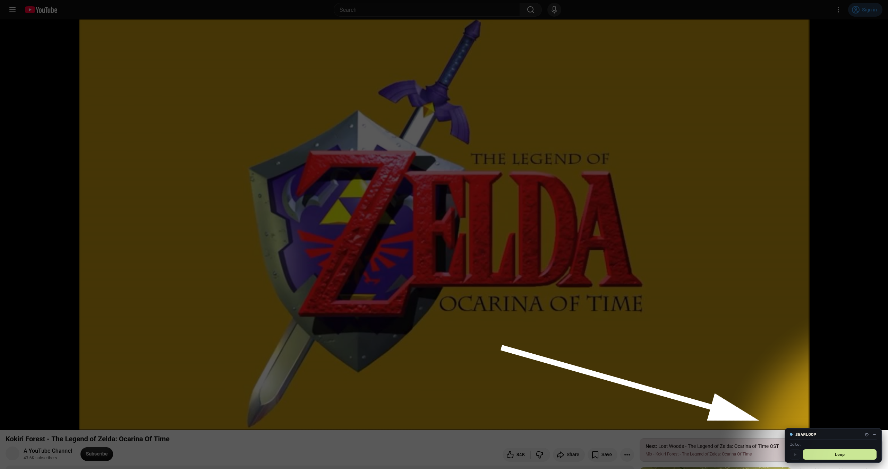

  

  
  

<h1 align="center">
  Seamloop
</h1>

  Loop any soundtrack (OST) seamlessly on YouTube and YouTube Music.

  For music written to loop indefinitely, the default repeat functionality on YouTube is often abrupt and noticeable. Seamloop detects exactly where the music repeats and loops it smoothly for as long as you want.

  

## Notes

- For proper usage, choose a video containing at least one repeat (whole or partial) of the music.
- If the loop is choppy, raising the "similarity threshold" typically yields a stronger match.
- When a loop cannot be found, lowering the "similarity threshold" increases the odds of finding it.
- Video scanning can be interrupted early for analysis once at least one repeat has been captured.
- Measures are in place to survive mid-roll ads. Ads may prolong scanning if "fast mode" is disabled.
- The length of scannable video is capped at the first 20 minutes due to memory use.
- Seamloop cannot download or export audio.

## Status

Compatible with Chrome ≥ 111 / Firefox ≥ 128. Safari impedes the necessary MediaSource hook injection.

For the specific thing I intended to do with Seamloop, I consider the current functionality sufficient.

If breakages are noticed, I'll look into repairs if feasible and whenever convenient.

Bug reports and forks are welcome!

## Privacy

Seamloop does not collect, store, or transmit any personal data.

It runs only on `youtube.com`/`music.youtube.com` and requests permission for `storage`.

## License

[MIT](LICENSE) © Shipshapen
